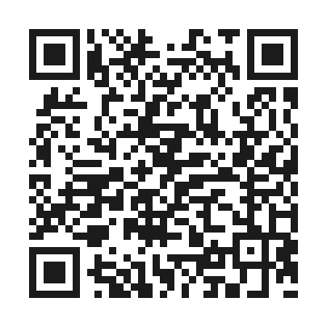
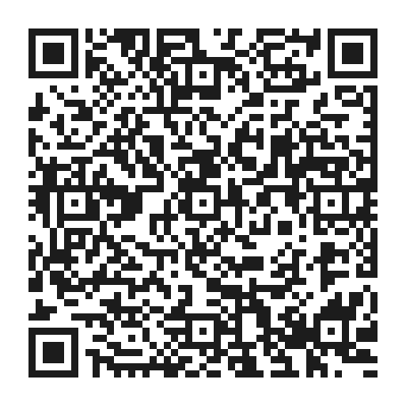

# Getting Started — Thunderboard Sense 2 Out-of-Box Experience

> Power it on, pair your phone, and watch live sensor data stream in under five minutes — no firmware flashing, no toolchain, no soldering. This is the demo Silicon Labs ships in the box so you can prove the hardware works before you write a single line of code.

This guide walks the **complete out-of-box experience (OOBE)** for the **Thunderboard Sense 2 (SLTB004A)**: what is already flashed on the board, how to power it, how it advertises over Bluetooth Low Energy (BLE), how to install and connect the companion mobile app, what each app screen shows, and how to push your data to the cloud. A troubleshooting section at the end covers the most common snags.

**Time to first success:** ~5 minutes from opening the box to seeing live 3D motion on your phone.

**Where this fits:** This is the *tutorial* entry point. Once you have run the demo and want to build your own firmware, jump to the [Development Toolchain](./07-development-toolchain.md). For what the board physically is, see the [Overview](./01-overview.md); for the chip running the show, see [SoC & Radio](./02-hardware-soc-radio.md).

---

## What You Need

| Item | Required? | Notes |
|------|-----------|-------|
| Thunderboard Sense 2 (SLTB004A) board | Yes | The board itself. |
| Micro-USB cable | For USB power | Data-capable cable (not charge-only). Used to power the board and, later, to flash/debug. |
| CR2032 coin cell | For wireless/untethered use | 3 V lithium coin cell. Not always included in the box — check your kit. |
| Smartphone (iOS or Android) | Yes | With Bluetooth enabled. |
| **Simplicity Connect** mobile app | Yes | Formerly **EFR Connect**. Free — [iOS](https://apps.apple.com/us/app/id1030932759) · [Android](https://play.google.com/store/apps/details?id=com.siliconlabs.bledemo). Install links + scannable QR codes in [Step 4](#4-install-the-simplicity-connect-app-ios--android). |
| Wi-Fi or cellular data on the phone | For cloud demo only | Needed only to push data to ThunderCloud. |

> **Note on the SoC:** The Thunderboard Sense 2 carries a **bare EFR32MG12 Wireless SoC** soldered directly to the board — specifically the **EFR32MG12P332F1024GL125** (1024 KB flash, 256 KB RAM, ARM Cortex-M4F). It is **not** an MGM12P pre-certified module; the radio matching network and antenna are implemented on the Thunderboard PCB itself. See [SoC & Radio](./02-hardware-soc-radio.md) for the full part breakdown.

---

## 1. What Ships Pre-Loaded (the BLE Demo)

Every Thunderboard Sense 2 leaves the factory with a **pre-loaded BLE demonstration firmware image** running on the EFR32MG12. This is the **Thunderboard demo** described in the kit user's guide (Silicon Labs document **UG313**, *Thunderboard Sense 2 Bluetooth Demo*; the board hardware itself is documented in **UG309**, *SLTB004A Thunderboard Sense 2 User's Guide*).

What the pre-loaded firmware does:

- Initializes the on-board sensor suite and the EFR32MG12 BLE stack.
- Advertises itself over BLE as a connectable peripheral (advertised name `Thunder Sense #nnnnn`, where `nnnnn` is derived from the board's unique BLE address).
- Exposes a set of GATT services that surface **environmental**, **motion/inertial**, and **I/O** data, plus battery/power information.
- Drives the on-board LEDs and reads the two push buttons so the mobile app can control and observe them.

You do **not** need to flash anything to run this demo. The firmware is already there. (When you later build your own application — see [Development Toolchain](./07-development-toolchain.md) — you can always restore this demo from Simplicity Studio's *Demos* tab or re-flash the prebuilt image.)

The sensors the demo reads are described in detail in [Sensors & Peripherals](./03-sensors-and-peripherals.md). In short, the demo exposes data from:

- **Si7021** — relative humidity & temperature
- **Si1133** — ambient light (lux) & UV index
- **BMP280** — barometric pressure
- **CCS811** — indoor air quality (eCO2 / TVOC)
- **ICM-20648** — 6-axis accelerometer + gyroscope (motion / orientation)
- **Si7210** — Hall-effect (magnetic field / door-open)
- **ICS-43434** — MEMS microphone (sound level)
- **4× high-brightness RGB LEDs + 1 bi-color status LED**, **2 push buttons (BTN0/BTN1)**

---

## 2. Power Options

The Thunderboard Sense 2 can be powered three ways. The board's **power-management circuitry** picks the right source (USB / coin cell / external) automatically — see [Pinout, Power & Connectors](./04-pinout-power-connectors.md) for the full power tree.

| Source | How | Best for |
|--------|-----|----------|
| **USB (micro-USB)** | Plug the micro-USB cable into the `J100` USB connector and a PC or USB charger. | Bench use, firmware development, AEM current measurement, and the cloud demo (always-on power). |
| **CR2032 coin cell** | Insert a 3 V CR2032 into the holder on the **back** of the board, positive (+) side facing up/out. | Wireless, untethered, battery-powered demos and field testing. |
| **External / battery header** | Supply regulated power via the kit's power input pins. | Custom enclosures and integration. |

**To start the demo the simplest way:** connect the micro-USB cable. The board powers up immediately, the firmware boots, and the green status LED begins its advertising blink (see next step).

> The board does **not** have a hard power switch for the coin cell. With a coin cell inserted and no USB attached, the board runs on the battery. Remove the coin cell to fully power down a battery-only board.

---

## 3. The ~30-Second BLE Advertise (Green LED)

When the board powers up (USB plugged in, or coin cell inserted), the pre-loaded firmware enters **BLE advertising mode**:

1. The board starts broadcasting connectable BLE advertising packets as `Thunder Sense #nnnnn`.
2. The **green LED blinks** to indicate active advertising — this is your visual cue that the board is discoverable and waiting for a phone to connect.
3. Advertising continues for approximately **30 seconds**. To conserve power (important on a coin cell), if **no connection is made within that window, the board stops advertising** and the green LED stops blinking.

**To re-trigger advertising after it times out:**

- Press the **left button (BTN0) or RESET**, **or**
- Cycle power (unplug/replug USB, or re-seat the coin cell).

The board will restart the ~30-second advertising window and the green LED will blink again. As a practical rule: **if you do not see the green LED blinking, the board is not advertising — press reset and connect within 30 seconds.**

---

## 4. Install the Simplicity Connect App (iOS + Android)

The companion app is **Simplicity Connect** — Silicon Labs' rebranded name (as of app **v2.9.0**) for what was previously called **EFR Connect** (and, in the original Thunderboard era, the standalone "Thunderboard" app). If you find an older "EFR Connect" or "Thunderboard" listing, Simplicity Connect is its current successor and is the recommended app. It is free on both platforms.

### Download links (verified)

| Platform | Direct link | Scan to install |
|----------|-------------|-----------------|
| **iOS / iPadOS** | [apps.apple.com/us/app/id1030932759](https://apps.apple.com/us/app/id1030932759) |  |
| **Android** | [play.google.com/store/apps/details?id=com.siliconlabs.bledemo](https://play.google.com/store/apps/details?id=com.siliconlabs.bledemo) |  |

> **Point your phone's camera at the matching QR code** above to jump straight to the store listing. Both QR payloads were decode-verified to resolve to the official Silicon Laboratories, Inc. app. The Android package ID `com.siliconlabs.bledemo` is the app's original EFR-Connect codename — a quick way to confirm you have the genuine app and not a clone.

### iOS

1. Open the **App Store**.
2. Search for **Simplicity Connect** (publisher: **Silicon Laboratories, Inc.**).
3. Tap **Get** / install.
4. On first launch, grant **Bluetooth** permission when prompted — without it the app cannot scan for the board.
   - On iOS, the app uses Core Bluetooth; location permission is **not** required for BLE scanning.

### Android

1. Open the **Google Play Store**.
2. Search for **Simplicity Connect** (publisher: **Silicon Laboratories, Inc.**).
3. Tap **Install**.
4. On first launch, grant the requested permissions:
   - **Nearby devices / Bluetooth** (Android 12+), **or**
   - **Location** (Android 11 and earlier) — Android historically required location permission to perform BLE scans. Granting it does not mean the app tracks your location; it is an OS requirement for Bluetooth scanning.

> **Tip:** Make sure your phone's **Bluetooth is turned on** at the OS level before opening the app. The app will prompt you, but it is faster to enable it up front.

---

## 5. Connect to the Board

1. **Power the board** and confirm the **green LED is blinking** (advertising — see Step 3). If it is not blinking, press reset first.
2. Open **Simplicity Connect** on your phone.
3. From the home screen, choose the **Demo** experience (the Thunderboard / sensor demo), as opposed to the raw "Develop"/Bluetooth Browser GATT explorer. The Demo path auto-detects Thunderboard boards and presents the friendly sensor dashboards.
4. The app scans and lists nearby devices. Look for **`Thunder Sense #nnnnn`** in the list.
   - The `#nnnnn` suffix is unique per board — useful when several boards are advertising in the same room.
5. **Tap the board entry** to connect. You must do this within the ~30-second advertising window.
6. On a successful connection, the app transitions into the demo dashboard and begins streaming live data. The green advertising blink stops once connected (the board is now in a connection, not advertising).

If the board disappears from the list before you tap it, its advertising window expired — press reset and pull-to-refresh the scan.

---

## 6. The Three App Screens

Once connected, the Simplicity Connect demo presents the board's data across three primary views. Switch between them using the in-app tabs/navigation.

### a) Motion (3D Orientation Render)

- Reads the **ICM-20648** 6-axis IMU (accelerometer + gyroscope).
- Renders a **live 3D model of the Thunderboard** that rotates in real time as you physically tilt and turn the board — the most immediately satisfying part of the demo.
- Also surfaces raw **orientation (pitch/roll/yaw)**, **acceleration**, and an **orientation/“calibrate”** control to zero the reference frame.
- Great quick test that BLE throughput and the IMU are both working: pick the board up and watch the model track your movement with minimal lag.

### b) Environment

- Aggregates the environmental sensor suite into a single live dashboard:

  | Reading | Sensor | Units |
  |---------|--------|-------|
  | Temperature | Si7021 | °C / °F |
  | Relative humidity | Si7021 | % RH |
  | Ambient light | Si1133 | lux |
  | UV index | Si1133 | UV index |
  | Barometric pressure | BMP280 | mbar / hPa |
  | Air quality — eCO2 | CCS811 | ppm |
  | Air quality — TVOC | CCS811 | ppb |
  | Sound level | ICS-43434 mic | dB |
  | Hall / magnetic field | Si7210 | field state / mT |

- Values update continuously over BLE. Breathe on the board or shine a light at it to watch humidity, CO2, and lux respond live.
- Note: the **CCS811 air-quality sensor needs a warm-up/burn-in period** after power-up before its eCO2/TVOC readings stabilize.

### c) I/O

- Mirrors and controls the board's discrete I/O:
  - **LEDs** — toggle the on-board LEDs / RGB LEDs from the phone and watch them light up on the board.
  - **Push buttons (BTN0 / BTN1)** — the app shows button state in real time; press a button on the board and watch the indicator change on screen.
- This screen proves the **bidirectional** path: the phone can both **read** inputs and **write** outputs over the GATT services.

---

## 7. Push Data to the Cloud (ThunderCloud / Firebase Web Client)

The Thunderboard demo includes an optional **cloud demo** that streams the board's live sensor data from your phone up to a hosted web dashboard, historically branded **ThunderCloud**. The web client is backed by **Google Firebase** (Realtime Database + hosting), and the mobile app acts as the BLE-to-cloud gateway — the board itself has no IP connectivity, so your phone relays the data.

### How it works

```
[Thunderboard Sense 2]  --BLE-->  [Phone + Simplicity Connect]  --HTTPS/Wi-Fi/cellular-->  [Firebase / ThunderCloud web dashboard]
   (EFR32MG12 + sensors)              (BLE-to-cloud gateway)            (live web client in any browser)
```

### Steps

1. Stay connected to the board in the app (Steps 5–6) and make sure the **phone has internet** (Wi-Fi or cellular).
2. In the demo, open the **cloud / "Connect to cloud"** action (look for a cloud icon or a *Stream to Cloud* / *ThunderCloud* option in the demo's overflow menu or header).
3. The app provisions a **unique session/short URL** for this board's live stream and uploads sensor readings to Firebase in real time.
4. The app displays (and lets you **share**) the web link. Open that URL in **any desktop or mobile browser** to see the same Environment / Motion / I/O data rendered as a live web dashboard.
5. Anyone you share the link with sees the live feed for as long as the phone stays connected and is uploading.

> **Why a phone in the middle?** The EFR32MG12 is a BLE SoC, not a Wi-Fi part — there is no on-board IP stack. The cloud demo deliberately demonstrates the common IoT topology where a constrained BLE sensor node reaches the internet through a smartphone (or, in production, a gateway). For a Wi-Fi-native cloud path you would pair the board with a separate gateway; that is out of scope for the OOBE.

---

## Troubleshooting

### The board shows up as a "TB004" USB drive (not a sensor)

When you plug the board into a PC over USB, the on-board **debug/interface MCU enumerates a small USB mass-storage drive**, typically labeled **`TB004`** (and/or a virtual COM port and a debug device). **This is normal and expected** — it is the board's management interface, not a fault.

- The `TB004` drive surfaces firmware/board info files; you can largely ignore it for the OOBE.
- The sensor data does **not** come over USB to that drive — it comes over **BLE to your phone**. Don't expect to "see sensors" by browsing the USB drive.
- If you only see the USB drive and no BLE activity: that is fine for the demo. USB is just providing power. Look at the **green LED** for advertising status and connect from the **phone**, not the PC.
- **Do not** delete files on the `TB004` drive or reformat it.

### The green LED won't blink / the board won't advertise

Work through these in order:

1. **Advertising timed out.** Advertising lasts only ~30 seconds. **Press the reset button** (or a push button) and immediately scan from the app. This fixes the most common case.
2. **No/insufficient power.**
   - On USB: confirm you are using a **data/power-capable** micro-USB cable, not charge-only, and that the PC port or charger is live. Try a different cable/port.
   - On coin cell: verify the **CR2032 is fresh** and inserted **+ side correctly**, fully seated in the holder on the back.
3. **Bluetooth off on the phone.** Enable Bluetooth at the OS level, then re-open the app.
4. **Missing app permissions.** On Android, grant **Nearby devices / Location**; on iOS, grant **Bluetooth**. Without these the app cannot discover the board even if it *is* advertising.
5. **Already connected elsewhere.** A BLE peripheral only holds one central connection. If another phone/tablet is connected to the board, it won't appear connectable to you. Disconnect the other device or power-cycle the board.
6. **Stale scan list.** Pull-to-refresh / restart the scan in the app, or fully close and reopen the app.
7. **Demo firmware was overwritten.** If you (or a previous user) flashed custom firmware, the demo is gone. Re-flash the **Thunderboard demo** from Simplicity Studio's *Demos* tab — see [Development Toolchain](./07-development-toolchain.md).

### Coin-cell limitations

- **Capacity, not voltage, is the constraint.** A CR2032 (~225 mAh) runs the demo for a long time when idle/advertising, but **continuous BLE streaming plus all sensors active drains it faster** — the CCS811 air-quality sensor and the high-brightness LEDs are notable current consumers. For long demos, prefer **USB power**.
- **Advertising auto-stops to save the battery.** The ~30-second advertising timeout (Step 3) exists specifically to preserve coin-cell life. On battery you will be pressing reset to re-advertise more often than on USB.
- **AEM current measurement needs USB.** The board's Advanced Energy Monitor reports current consumption only when powered/observed over the USB debug interface — you cannot read AEM data while running purely on a coin cell. See [Pinout, Power & Connectors](./04-pinout-power-connectors.md).
- **Brown-out under load.** A weak or partially depleted coin cell can sag under the inrush of the radio + LEDs and cause resets or dropped connections. If the board behaves erratically only on battery, **replace the CR2032 or switch to USB**.
- **No coin cell included?** Some kit revisions ship without the CR2032. If yours did, the board still runs fully on USB for the entire OOBE — the coin cell only matters for untethered use.

---

## You Did It — What You Built

By the end of this guide you have:

- Confirmed the board's **pre-loaded BLE demo** (UG313) runs on the bare **EFR32MG12**.
- Powered the board over **USB and/or coin cell**.
- Triggered and connected within the **~30-second BLE advertising** window (green LED).
- Streamed **live motion, environment, and I/O** data to **Simplicity Connect**.
- Optionally relayed that data to the **ThunderCloud / Firebase web client** and shared a live link.

## Next Steps

- **Build your own firmware:** [Development Toolchain](./07-development-toolchain.md) — Simplicity Studio, Gecko SDK, Zephyr, Matter, Arduino, Edge Impulse.
- **Understand the radio you just used:** [SoC & Radio](./02-hardware-soc-radio.md).
- **Dig into each sensor the demo read:** [Sensors & Peripherals](./03-sensors-and-peripherals.md).
- **Wire up your own hardware:** [Pinout, Power & Connectors](./04-pinout-power-connectors.md).
- **See what people build with it:** [Use Cases & Applications](./05-use-cases-applications.md).
- **Look up part numbers and docs:** [References & Glossary](./08-references-glossary.md).

Back to the [documentation hub](./README.md) · [Overview](./01-overview.md).

---

### Sources

- Silicon Labs — *UG309: SLTB004A Thunderboard Sense 2 User's Guide* (board hardware, power, LEDs, USB interface).
- Silicon Labs — *UG313: Thunderboard Sense 2 Bluetooth Demo* (pre-loaded demo, advertising behavior, app screens).
- Silicon Labs — [Thunderboard product family](https://www.silabs.com/development-tools/thunderboard).
- Silicon Labs — [Simplicity Connect (formerly EFR Connect) mobile app](https://www.silabs.com/developer-tools/simplicity-connect-mobile-app). Store listings: [Apple App Store (id1030932759)](https://apps.apple.com/us/app/id1030932759) · [Google Play (com.siliconlabs.bledemo)](https://play.google.com/store/apps/details?id=com.siliconlabs.bledemo). App renamed from **EFR Connect** to **Simplicity Connect** in v2.9.0 (verified against the App Store listing and the Silicon Labs app page, 2026-06-06).
- EFR32MG12 part: **EFR32MG12P332F1024GL125** — see the [EFR32MG12 Wireless Gecko data sheet](https://www.silabs.com/documents/public/data-sheets/efr32mg12-datasheet.pdf).

*Cross-checked against the project ground truth: the SLTB004A carries a **bare EFR32MG12 SoC**, not an MGM12P module.*
